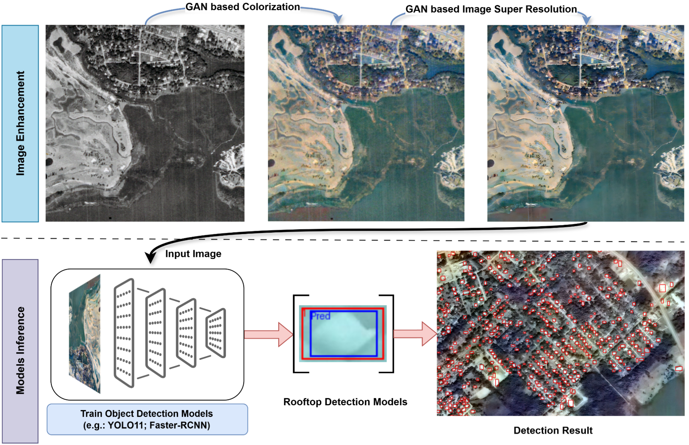
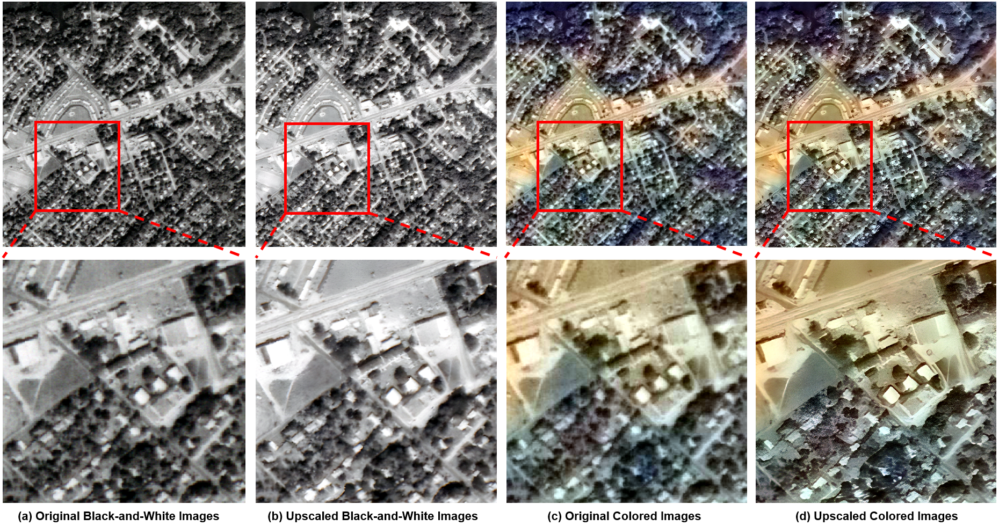
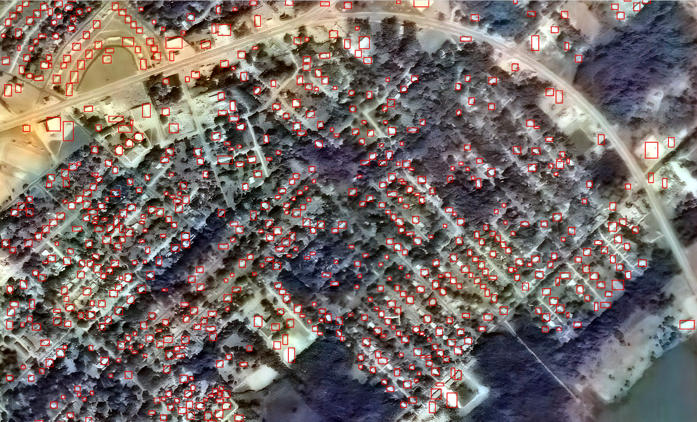

## A GAN-Enhanced Deep Learning Framework for Rooftop Detection from Historical Aerial Imagery

**Pengyu Chen**, Sicheng Wang*, Cuizhen Wang, Senrong Wang, Beiao Huang, Lu Huang, Zhe Zang  

*University of South Carolina, Wuhan University of Technology, Wuhan University, Ocean University of China*  

## Abstract

>Precise detection of rooftops from historical aerial imagery is essential for analyzing long-term urban development and human settlement patterns. Nonetheless, black-and-white analog photographs present considerable challenges for modern >object detection frameworks due to their limited spatial resolution, absence of color information, and archival degradation. To address these challenges, this research introduces a two-stage image enhancement pipeline based on Generative >Adversarial Networks (GANs): image colorization utilizing DeOldify, followed by super-resolution enhancement with Real-ESRGAN. The enhanced images were subsequently employed to train and evaluate rooftop detection models, including Faster >R-CNN, DETReg, and YOLOv11n. The results demonstrate that the combination of colorization with super-resolution significantly enhances detection performance, with YOLOv11n achieving a mean Average Precision (mAP) exceeding 85\%. This >signifies an enhancement of approximately 40\% over the original black-and-white images and 20\% over images enhanced solely through colorization. The proposed method effectively bridges the gap between archival imagery and contemporary >deep learning techniques, facilitating more reliable extraction of building footprints from historical aerial photographs.

We propose a two-stage **GAN-based image enhancement pipeline**:
1. **Image Colorization** (using *GAN--DeOldify*)
2. **Super-Resolution** (using *Real-ESRGAN*)

These enhanced images are then used for training rooftop detection models including:
- **YOLOv11n**
- **Faster R-CNN**
- **RT-DETR**

Our method improves detection accuracy by up to **40%** over raw historical images and up to **20%** over colorized-only images — with **YOLOv11n achieving mAP > 85%**.

---

## Getting Started
📁 colorization/         → GAN-based colorization of grayscale images

📁 super_resolution/     → Real-ESRGAN-based image upscaling

📁 detection/            → Rooftop detection using YOLOv11n, Faster R-CNN, RT-DETR
**Setup Environment (Colab Friendly)**
- All notebooks are tested in Google Colab.
- Dependencies are listed in the first few cells of each notebook.

## Sample results
### Colorization & Super-resolution result

  

### Detection result

  
  

### 📬 Contact
**For questions or collaborations, feel free to reach out:**

Pengyu Chen: pengyuc@email.sc.edu 

Sicheng Wang: SICHENGW@mailbox.sc.edu
